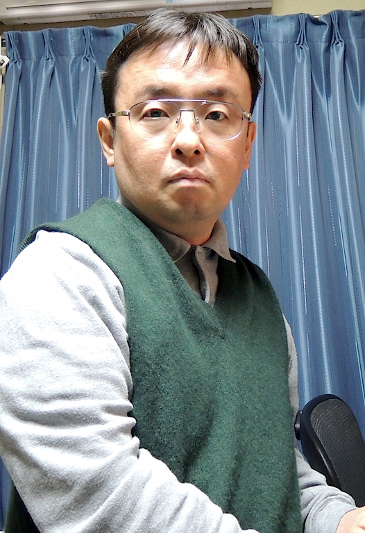

footer: Kenji Rikitake / oueees 201506 intro
slidenumbers: true

# 電気工学特別講義 2015年6月[9,16,23]日 イントロダクション

<!-- Use Deckset 1.4, Next theme, 4:3 aspect ratio -->

---

# OU EE ES Lecture Series June [9,16,23], 2015 Introduction

---

## Kenji Rikitake

## りきたけ けんじ

## 力武 健次

9-JUN-2015
School of Engineering Science
Osaka University
Toyonaka, Osaka, Japan
@jj1bdx

---

# Who I am 自己紹介

---

# Professional lnternet Engineer

---

# 技術士 （情報工学部門）

---

# 39 years of ham radio licensee @jj1bdx

---

# 25 years of computer science experience

---

# 10 years since PhD

---

# 2010-2012: Professor, ACCMS/IIMC, Kyoto University

---

# *So what?*

---

# I'm just an old man

---

# Protip: don't listen to what old people say

---

# Protip 2: speak and think in English

---

# Protip 3: do and try everything by yourself

---

# Protip 4: watching a lecture won't teach you anything

---

# Protip 5: writing code and making things are *fun*

---

# Lecture theme: *sustainability*

---

# Sustainable computers, internet, and social systems

---

# Why sustainability?

---

# Resources are limited

---

# Life is short; we must survive

---

# We need to pass it on, to the next generation(s)

---

# *Can we?*

---

# WARNING

---

# My talks are only for your food of thought

---

# It's *your* job to think

---

# OK let's get down to business!

