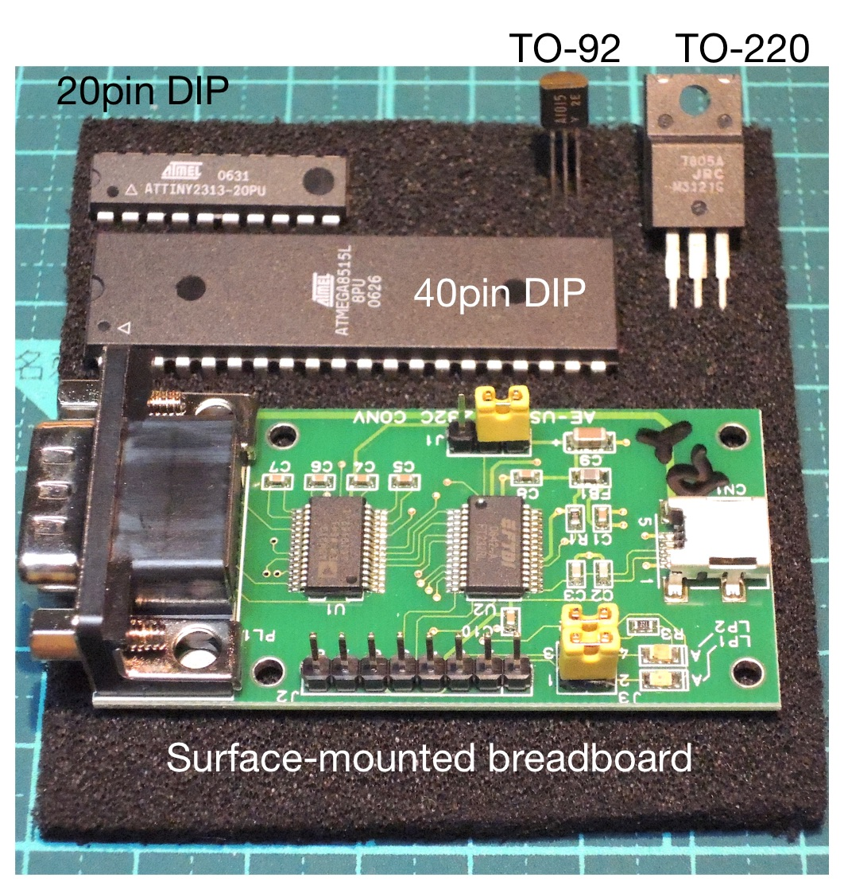
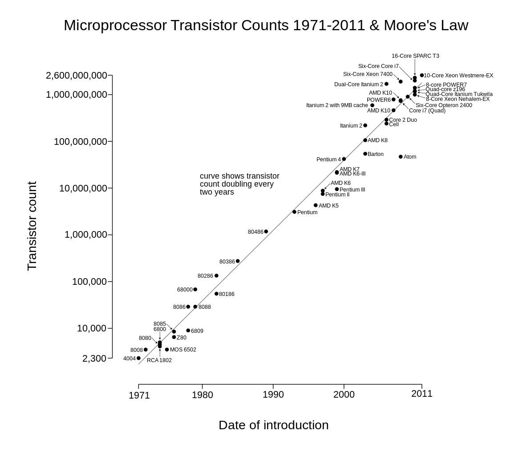

footer: Kenji Rikitake / oueees 201506 part 1 9-JUN-2015
slidenumbers: true

# oueees-201506 Part 1: Sustainable computer systems and networks

<!-- Use Deckset 1.4, Next theme, 4:3 aspect ratio -->

---

# Kenji Rikitake

9-JUN-2015
Faculty of Engineering Science
Osaka University
Toyonaka, Osaka, Japan
@jj1bdx

---

# Lecture notes on GitHub

* [https://github.com/jj1bdx/oueees-201505-public/](https://github.com/jj1bdx/oueees-201505-public/)
* Don't forget to *check out the issues*!

---

# Sustainable computer systems

---

# Computer becomes more mobile

* Physically small
* Less physical constraints
* Less power

---

# For better mobility

* Smaller parts
* Higher available energy density
* Less wires or cables
* Less energy consumption
* Details on energy issues will be explained in another talk of this lecture series

---

# Computer needs *millions* of devices

* DRAM: 1 transistor = 1 bit
* 4 Gigabytes = 32G transistors (or more)
* 4GB DDR3 SDRAM: ~7W (0.2nW/transistor)
* Intel 18-core CPU: 5.6B transistors [^1]
* CPU consumes power: ~26nW/transistor [^2]

[^1]: [Intel Xeon E5-2699 v3, 18 Cores](http://forwardthinking.pcmag.com/none/327190-intel-s-latest-server-chips-provide-glimpse-of-a-changing-industry)

[^2]: [Intel's pdf brochure says: 145W TDP](http://www.intel.com/content/dam/www/public/us/en/documents/product-briefs/xeon-e5-brief.pdf)

---

# Smaller devices

* Vacuum tubes: ~W/tube
* Discrete Transistors: ~mW/chip
* Integrated circuits (ICs): nW/chip
* [Atom transistors: pW/chip or less](https://www.int.kit.edu/2582.php)
* Using less energy per device

---

# Smaller electronic circuits

* Hand mounting: TO-92, TO-220, 
* Hand mounting ICs: SIP, DIP
* Surface mounting: SOIC, BGA, PGA
* *Higher density*: the *same or even more energy per system*
* More *heat*

---

# Electronic parts

---

# Moore's law

"[...] over the history of computing hardware, the number of transistors in a dense integrated circuit has doubled approximately every two years. " [^3]

## An important issue

* Can we proceed forever with this law?

[^3]: http://en.wikipedia.org/wiki/Moore%27s_law

---

<!-- CC-SA licensed from WikiPedia, http://commons.wikimedia.org/wiki/File:Transistor_Count_and_Moore%27s_Law_-_2011.svg -->

---

# Issues on mobility: physics

* Power consumption
* Radio bandwidth limitation 
* Latency (= speed of light)

## Question

* How can we solve these issues?

---

# Sustainable computer networks

---

# We all live in the Internet

---

# "The network is the computer" [^4]

[^4]: [By John Gage, also popular as the Sun Microsystems' Slogan, presumably coined in 1982](http://en.wikipedia.org/wiki/John_Gage)

---

# Wired and wireless networks

* Wired networks: optic fibers and metal/coaxial cables, smaller error rates
* Wireless networks: mostly on radiowaves (some on lightwaves), more error prone
* Speed of wired networks is *~1000 times faster than wireless networks*

---

# Wired communications

* Consumer: 1000BASE-T, 1Gbps
* Higher speed: 10G/40G/100Gbps Ethernets
* Interconnects: InfiniBand, SATA, PCIe
* I/O: HDMI, USB, Thunderbolt
* ... and many other standards

---

# Wireless communications

* Wifi: 20MHz for max 54Mbps (IEEE 802.11b)
* LTE: 20MHz for 150Mbps
* Endpoint protocols: Bluetooth (BLE), Zigbee
* ~1000 times *slower* than *wired* networks
* ~1 *million more times of error rates*

---

# Issues on networks

* Physics: speed of light
* Addressing objects
* Routing between nodes/networks

---

# Question: can we make all networks wireless?

---

