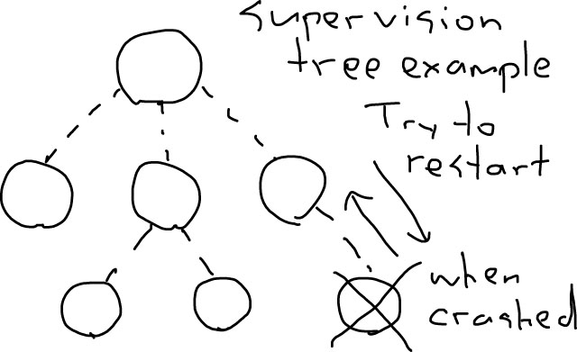

footer: Kenji Rikitake / oueees 201506 part 2 16-JUN-2015
slidenumbers: true

## oueees-201506 Part 2: operation and developement of large-scale information systems

<!-- Use Deckset 1.4, Next theme, 4:3 aspect ratio -->

---

# Kenji Rikitake

16-JUN-2015
School of Engineering Science
Osaka University
Toyonaka, Osaka, Japan
@jj1bdx

---

# Lecture notes on GitHub

* [https://github.com/jj1bdx/oueees-201505-public/](https://github.com/jj1bdx/oueees-201505-public/)
* Don't forget to *check out the issues*!

---

# Cloud computing systems

---

---

# Cloud computing elements

* Servers and services on the Internet
* Endpoint terminals (smartphones, tablets, laptops, etc.) *outside* the cloud
* *Highly centralized systems depending on the Internet*

---

# Inside the services

* A cluster of distributed systems
* Multiple computers *collaboratively* connected to do the same task
* *Highly decentralized* or even *distributed*

---

Forms of networks [^1]

[^1]: Carl S. Sterner, Resilience and Decentralization, <http://www.carlsterner.com/research/2009_resilience_and_decentralization.shtml>

---

Real world: hierarchy *and* decentralization [^2]

[^2]: By Jurgen Appelo, licensed CC BY 2.0, <https://www.flickr.com/photos/jurgenappelo/5201869924/>

---

## Centralized social behavior accerelated by cloud computing

* Sharing *everything* - no privacy
* *Panopticon* [^3] style of governance, filtering, *censorship, or autocracy*
* Complete *externalization* of resources, leading to *no personal control*

[^3]: n. a circular prison with cells arranged around a central well, from which prisoners could at all times be observed. (New Oxford American Dictionary, Apple OS X 10.10.3)

---

Precidio Modelo Prison [^4]

[^4]: Friman, licensed CC BY-SA 3.0, <https://en.wikipedia.org/wiki/Panopticon#/media/File:Presidio-modelo2.JPG>

---

Panoption plan example (public domain)

---

# INGSOC

The slogans: [^5]

* War is peace
* Freedom is slavery
* Ignorance is strength

* Independent thinking = *thoughtcrime*

## NOTE: this is a *fiction*!

[^5]: George Orwell, "Nineteen Eighty-Four", 1949.

---

# Perpetual War 常在戦場

---

# Why cloud computing has become so *dystopian*?

---

# We have sold freedom for *convenience*

---

## Convenience of centralized systems

* Ubiquitous/global accessibility
* Concentrated data for easy analysis
* Easy control of the information flow
* No extra cost for sharing
* No need to think about where the information locates

---

# The inconvenient truth of centralized systems

---

# What if the core/cloud fails?

---

## Inconvenience of centralized systems

* Ubiquity or *no accessibility*
* When the core fails, no alternative
* When the core loses data, *no backup*
* The system performance is restricted by the capability of the core
* Endpoint systems will lost *all capabilities*

---

# Centralized systems are *not* sustainable

---

# Sustainable information systems: decentralized and distributed

---

# Real-world challenges

* Natural disasters
* Device failures
* Human operation errors
* Political impediments
* Social resentments

---

# Handling *failures*

* Redundancy: keeping backup units ready
* Fault tolerance: keeping systems running even the components fail
* Resilience by failing fast: early detection of failures and invocation of the recovery procedures

---

# Why fault tolerance?

* Hard disk MTBF ~= 1 million hours
* 1000 hard disks running 24 hours x 365 days = 8.76 million  hours
* If you're running a system with 1000 hard disks, *nine* out of 1000 will fail in a year
* Recovery of a disk content takes often *a day*
* You can't stop a system for *a day*, can you?

---

# Requirement to keep the systems fault tolerant

* Redundancy: two or more resources for each unit of processing
* Supervising the failure of the units by an independent supervisor
* Rollback capability: undo the incomplete operations and retry

---

# Supervisor

---

Consistent hashing of Basho Technologies' Riak database [^6]

[^6]: (Note: Rikitake was a Basho Technologies employee during February to September 2013.) <http://docs.basho.com/riak/latest/theory/concepts/Clusters/>

---

# Fault tolerance of Riak

* Multiple copies for each data bucket
* Data evenly distributed to each cluster member node, more resilient to failures
* Even if a node fails, the other nodes respond with the valid data
* Recovery replication will happen after the node recovery
* All *automated*

---

# The inconvenient truth of distributed systems

---

# Consistency: hard or impossible to maintain

---

# Net split

Recovery from net split is complex

---

# Concurrency: every system is running on its own; synchronization needed

---

# Synchronization

---

# Locking

---

## How precise the locking or synchronization timing should be?

* *It depends on the application*
* Bank transaction: strict
* Shopping cart: not necessarily strict
* Domain Name System: loose

---

# Current trend: less locking, more inconsistency allowance

---

# Questions

* How much is the cost of synchronization?
* Why do we need concurrent systems? Stability? Performance?
* What have we traded in for obtaining the *convenient cloud computing systems*? Can we take them back?
