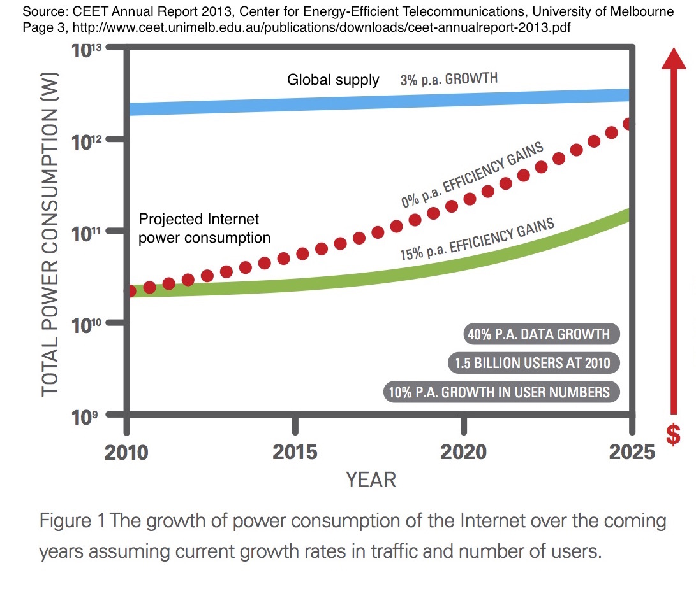
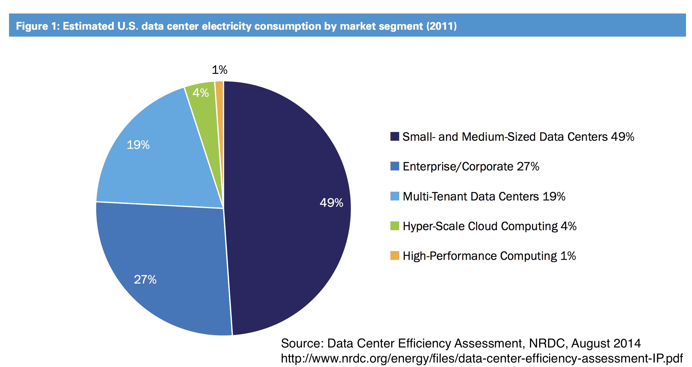
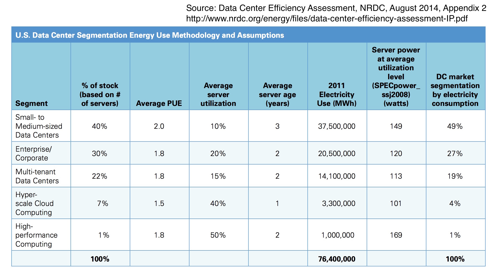

footer: Kenji Rikitake / oueees 201506 part 3 23-JUN-2015
slidenumbers: true

<!--- これはEmacsでUnicodeを自動検知させるためのkludgeです -->

# oueees-201506 Part 3: Environmentally-sustainable computing

<!--- Use Deckset 1.4, Next theme, 4:3 aspect ratio -->

---

# Kenji Rikitake

23-JUN-2015
School of Engineering Science
Osaka University
Toyonaka, Osaka, Japan
@jj1bdx

---

# Lecture notes on GitHub

* [https://github.com/jj1bdx/oueees-201505-public/](https://github.com/jj1bdx/oueees-201505-public/)
* Don't forget to *check out the issues*!

---

# Sustainability: economic feasibility, energy efficiency, scalability

---

# Economic feasibility of computing

* Device production: can we make it?
* Complexity: can we solve it?
* Energy consumption: can we feed them?

---

# Tackling with physics

* Speed of light = latency
* Heat dissipation
* Device density
* Radio bandwidth limitation
* Scaling by distribution

---

# Tackling with complexity

* Addressing objects
* Routing computation
* Autocracy .vs. distribution
* Concurrency .vs. consistency
* System administration cost

---

# Tackling with scalability

* Scalable: *handling growth*
* Scaling up: higher processing power
* Scaling out: more computer units
* Consistency .vs. scalability
* Efficiency issues: power consumption, parallelized speed gain, inconsistency allowance

---

# Energy consumption: the final frontier

---

# (Information) CAPITALISM

---

# Towards information capitalism

* Mercantillism: collecting wealth, colonialization, trade barriers
* Industrial capitalism: factory, labor division, industrialization, imperialism
* Information capitalism: investment (derivatives), for-profit, commoditization

---

# An information capitalism principle: hyper over-provisioning

* Resource extinction *instantly* kills the system
* For preventing the extinction or starvation, *keep the resources as much as you can*
* Implication: *expansionism*
* Assumption: resources are *infinite*

---

# Question: are natural resources *infinite*?

---

# Our lives depend on electricity

---

# Electricity as energy

* Well-established transportation technologies: high-voltage wires (with superconductivity)
* Can be saved in various forms: chemical energy (batteries), potential energy (dams), physical energy (flywheels)
* Relatively easier to control the flow
* Safer than natural gas and liquid fuels

---

# Problems on energy consumption

* Quantity: *exponentially increasing*
* Efficiency: improvement stagnated (e.g., electricity delivery loss)
* Demand and desire: more and more people want to *modernize* their lives
* Many stakeholders of conflicting interests

---

---

---

## An alarming prediction: Internet may use up all electricity supply capability by 2025

---

---

# Data centers in the USA

* 12M servers in 3M data centers [^1]
* 2013: 91TWh / 34 x 0.5GW power plants
* 2020: 140TWh / 50 x 0.5GW power plants
* 2020: 150Mt CO2 pollution

[^1]: [Data Center Efficienct Assessment, Natural Resource Defense Council, August 2014](http://www.nrdc.org/energy/data-center-efficiency-assessment.asp)

---

# Data center metrics

* Server utilization rate
* Power Usage Effectiveness (PUE)

---

# Server utilization rate

* [processing load] / [maximum server capacity]
* 10% utilization rate server can spend 30% to 60% of power

---

# Power Usage Effectiveness (PUE)

* Measuring *cooling* efficiency
* [total power] / [server-consumed power]
* should be <2.0, closer to 1.0 is better

---
# USA data centers in 2011

* Only 5% of DC-spent power is low PUE
* 40% of servers in small-to-medium DCs consume 49% of total electricity
   * PUE ~= 2.0, utilization: low as 10%
   * older servers (3 years old)

---
# DC operating issues

* Too much over-provisioning (~ +50%)
* Low virtualization daployment rate (~30%)
* Too many *unused* servers (20~30%)
* Power management not well deployed

---

# Small and inefficient data centers are the majority

---

# The numbers

---

# Issues of Japanese DCs

* Natural disasters (earthquakes)

* Fluctuating *industrial* power supply: not something solvable by "saving energy" in the *residential* sector

* The price of electricity is *very high*

* Japan is at an *edge* of world Internet trans-ocean links and have little direct oversea links

---

# The future is grim

---

# Can we sustain the level of the modern computing society?

<!--- -*- coding: utf-8; -*- -->
