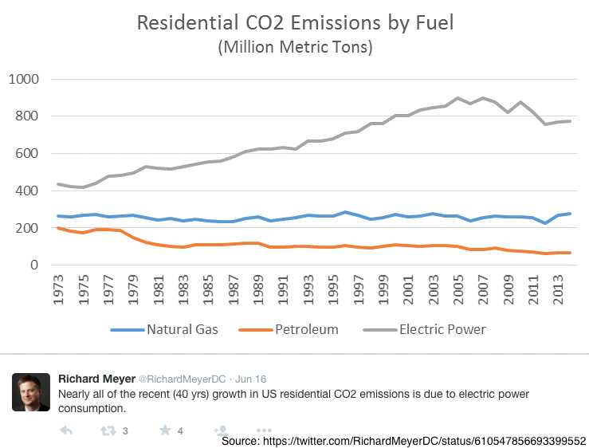

footer: Kenji Rikitake / oueees 201506 part 3 23-JUN-2015
slidenumbers: true

<!--- これはEmacsでUnicodeを自動検知させるためのkludgeです -->

# oueees-201506 Part 3: Environmentally-sustainable computing

<!--- Use Deckset 1.4, Next theme, 4:3 aspect ratio -->

---

# Kenji Rikitake

23-JUN-2015
School of Engineering Science
Osaka University
Toyonaka, Osaka, Japan
@jj1bdx

---

# Lecture notes on GitHub

* [https://github.com/jj1bdx/oueees-201505-public/](https://github.com/jj1bdx/oueees-201505-public/)
* Don't forget to *check out the issues*!

---

# Sustainability: economic feasibility, energy efficiency, scalability

---

# Economic feasibility of computing

* Device production: can we make it?
* Complexity: can we solve it?
* Energy consumption: can we feed them?

---

# Tackling with physics

* Speed of light = latency
* Heat dissipation
* Device density
* Radio bandwidth limitation
* Scaling by distribution

---

# Tackling with complexity

* Addressing objects
* Routing computation
* Autocracy .vs. distribution
* Concurrency .vs. consistency
* System administration cost

---

# Tackling with scalability

* Scalable: *handling growth*
* Scaling up: higher processing power
* Scaling out: more computer units
* Consistency .vs. scalability
* Efficiency issues: power consumption, parallelized speed gain, inconsistency allowance

---

# Energy consumption: the final frontier

---

# (Information) CAPITALISM

---

# Towards information capitalism

* Mercantillism: collecting wealth, colonialization, trade barriers
* Industrial capitalism: factory, labor division, industrialization, imperialism
* Information capitalism: investment (derivatives), for-profit, commoditization

---

# An information capitalism principle: hyper over-provisioning

* Resource extinction *instantly* kills the system
* For preventing the extinction or starvation, *keep the resources as much as you can*
* Implication: *expansionism*
* Assumption: resources are *infinite*

---

# Our lives depend on electricity

---

# Electricity as energy

* Well-established transportation technologies: high-voltage wires (with superconductivity)
* Can be saved in various forms: chemical energy (batteries), potential energy (dams), physical energy (flywheels)
* Relatively easier to control the flow
* Safer than natural gas and liquid fuels

---

# Problems on energy consumption

* Quantity: *exponentially increasing*
* Efficiency: improvement stagnated
* Demand and desire: more and more people want to *modernize* their lives
* Many stakeholders of conflicting interests

---

---

---

<!--- -*- coding: utf-8; -*- -->
